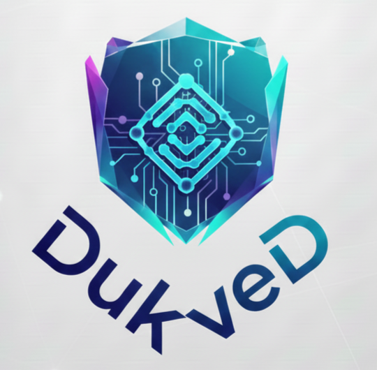

<!-- version de PHP -->

## Objetivos del Proyecto

Construir un sistema POS profesional, modular y escalable para una cadena de tiendas de tenis con múltiples sucursales físicas. Debe soportar ventas en tienda, gestión de inventario y transferencias entre sucursales, control de cajas, reportes comerciales, gestión de clientes y productos, integraciones de pago y administración centralizada:

## Ecosistema tecnológico propuesto

- **Laraval V12** Utilizar Laravel (PHP) como framework backend principal, con Blade/Livewire para el frontend. Laravel ofrece una base sólida, ecosistema maduro y herramientas integradas para autenticación, colas, notificaciones y más.

- **Base de datos MySQL**: Utilizar MySQL como base de datos relacional para almacenar productos, ventas, usuarios, inventarios y demás datos estructurados.

## Alcance (MVP)

### Funcionalidades mínimas necesarias para arrancar en producción en sucursales:

- **Login / autenticación y control de roles (Cajero, Supervisor, Administrador)**
- **Pantalla de venta (POS) con búsqueda por SKU, código de barras y nombre.**
- **Apertura/cierre de caja por usuario por sucursal.**
- **Gestión de productos: SKU, tallas, colores, stock por sucursal, precio, costo, imágenes.**
- **Gestión de clientes (básica): nombre, contacto, historial de compras.**
- **Inventario por sucursal + ajustes manuales y recepción de compras.**
- **Facturación / recibos (impresión/ticket) y exportación (PDF).**
- **Reportes básicos: ventas por día/sucursal, top productos, control de caja.**
- **Registro de usuarios y auditoría de acciones (quién hizo qué).**
- **Soporte para varias sucursales y vista centralizada.**
- **Exportes CSV / Excel para contabilidad.**

## Perfiles funcionales (detallados)

- **Administrador: acceso total, configuración global, crear sucursales, usuarios.**

- **Supervisor / Gerente de Sucursal: reportes extendidos de su sucursal, ajuste de stock, devoluciones aprobadas.**

- **Vendedor : realizar ventas, buscar productos, gestionar carrito.**

- **Cajero: operar POS, abrir/cerrar caja, registrar ventas y devoluciones.**

- **Contabilidad (opcional): acceso a exportes y reportes contable**

## POS (flujo de venta)

- **Selección de sucursal.**

- **Crear venta: agregar productos por código, escanear, ajustar cantidad, aplicar descuento global o por línea.**

- **Manejar tallas/variantes: cuando un producto tenga variantes (talla, color), selección clara en la UI.**
- **Métodos de pago: efectivo, tarjeta (pos/pasarela), transferencia, cupón/regalo.**

- **Cierre de venta: generar recibo, disminuir stock en la sucursal, registrar en caja.**

- **Notas en venta (ej. reserva, pedido a otra sucursal).**

## Caja

- **Apertura de caja: monto inicial.**

- **Movimientos de caja: ingreso/egreso (gastos), cierre de caja diario con conciliación.**

- **Historial y auditoría de cierres.**

## Inventario

- **Stock por sucursal y stock total consolidado.**

- **Recepciones (entradas): compras a proveedor o transferencias entre sucursales.**

- **Salidas: ventas, ajustes por pérdida/rotura, devoluciones.**

- **Alertas por stock mínimo.**

- **Lote/serie (opcional) — no crítico para tienda de tenis, salvo que lo necesites.**
## Productos y variantes

- **Producto padre + variantes por talla/color.**

- **SKU único por variante (recomendado).**

- **Gestión de múltiples precios (precio público, precio por promoción, precio mayorista).**
- **Imágenes y descripción.**

## Clientes y fidelización

- **Registro sencillo: nombre, teléfono, email, notas.**

- **Historial de compra por cliente.**

- **Programa de puntos/cupones (extra, para fase posterior).**
## Reportes

- **Ventas por día/semana/mes por sucursal y consolidado.**

- **Top 10 productos vendidos.**

- **Margen bruto / costos.**

- **Movimientos de caja e historial de cierres.**

- **Inventario valorizado por sucursal.**

## Integraciones

- **Impresora de tickets (local) — idealmente usar impresión a navegador o mediante un pequeño servicio local.**

- **Pasarelas de pago (integrar POS o gateway según país).**

- **ERP/contabilidad (exportes o API).**

- **Barcode scanner (entrada de teclado HID).**

## 4. Requisitos no funcionales

- **Autenticación segura (Laravel Fortify ya en composer).**

- **Multi-tenant lógico por sucursal (misma base, separación por sucursal en datos).**

- **Alta disponibilidad y tolerancia a fallos mínima: backups diarios, snapshots.**

- **Escalabilidad horizontal en la capa web (Docker / Kubernetes posible).**

- **Latencia baja en POS: interfaz rápida; minimizar round-trips a servidor.**

- **Logs y auditoría (quien hizo qué y cuándo).**

- **Seguridad: OWASP, cifrado de datos sensibles, protección CSRF, rate limiting.**

- **Localización: español (Colombia) por defecto con posibilidad de más idiomas.**

- **Accesibilidad y UI responsive (tablets/PCs de caja).**

## Arquitectura propuesta (alto nivel)

- **Frontend: Blade + Livewire (Flux/Volt) — UI reactiva sin SPA completa; componentes para POS, formularios y reportes.**

- **Backend: Laravel 12 (PHP ^8.2) con Fortify para autenticación.**

- **Base de datos: MySQL. Diseño relacional normalizado con tablas: users, clientes, sucursales,  productos, variantes, inventarios, ventas, lineas_venta, cajas, movimientos_caja, clientes, proveedores, transferencias, logs.**

- **Capa de servicios: servicios PHP (Domain Services) para lógica de stock, cierre de caja, cálculo de precio/margen — separar lógica de controladores.**

- **Repositorio: https://github.com/SantiagoUniAJC/DukPOS**

- **Colas: Redis + Laravel Queue para tareas asíncronas (envíos de correo, generación de reportes pesados, sincronización).**

- **Cache: Redis para caches de catálogo y sesiones.**

- **File Storage: S3 compatible o almacenamiento local para imágenes de productos.**

- **CI/CD: GitHub Actions / GitLab CI para tests y despliegue automatizado.**

- **Monitoreo: Sentry (errores), Prometheus/Grafana u otros para métricas.**

## License

The Laravel framework is open-sourced software licensed under the [MIT license](https://opensource.org/licenses/MIT).
